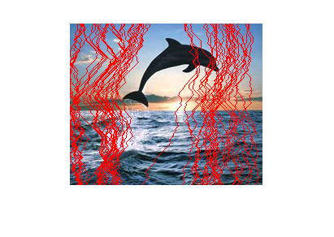
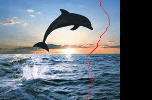
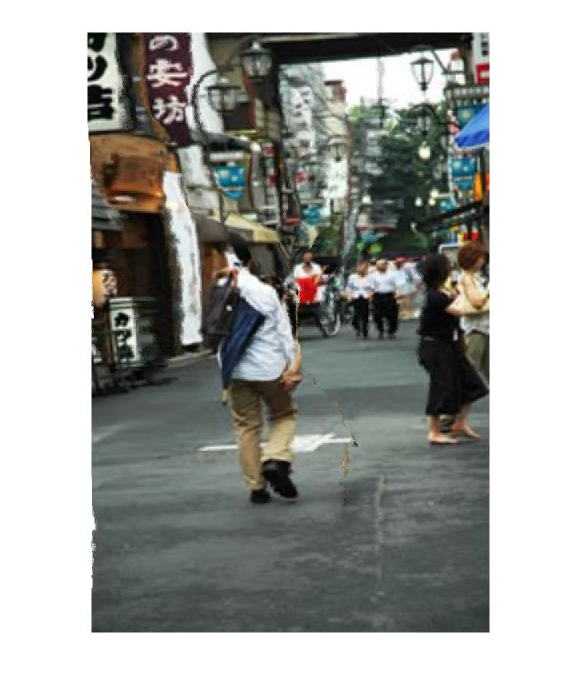
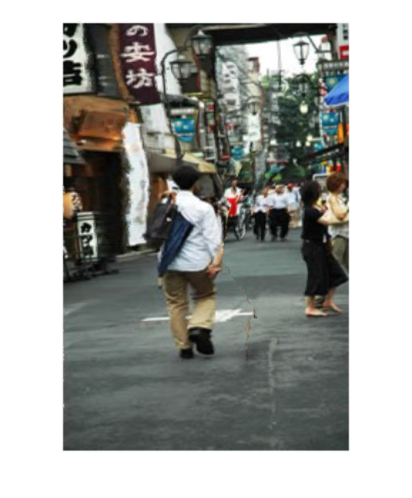
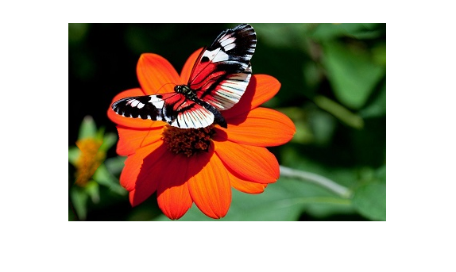
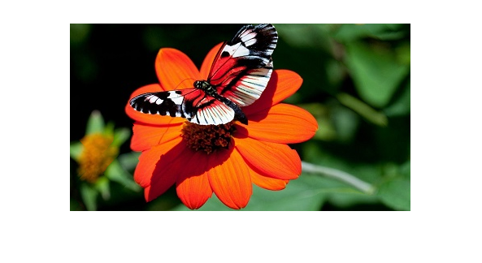
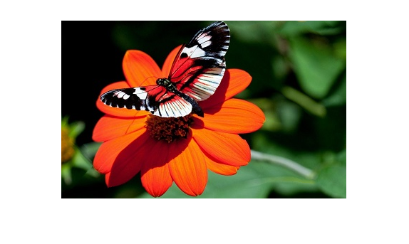

# content_aware_seam_carving 
# Vertical Seam removal 
Original image 
 
Process in action 
 
Final image 
 

# Horizontal Seam removal 
Original image 
 
Process in action 
 
Final image 
 

# Seam insertion 
Original image 
 

Energy function 1 (absolute sum of gradient in x and y) 
Seam to be inserted 
 
Process in action 
 
Final image 
 

Energy function 3 (Entropy filter) 
Process in action 
 
Final image 
 

# Object removal 
Original image 
 
Using vertical seams 
 
Using horizontal seams 
 

Prevent one object from distortion while removing other nearby object 
-Without priortizing the object 
 
-With high value assigned in energy function 
 
-process in action 
 

# Comparing optimal seam removal with sub-optimal methods 
Original image 
 
-Vertical seam then horizontal 
 
-Horizontal seam then vertical 
 
-Alternating vertical and horizontal 
 
-Optimal method 
 
