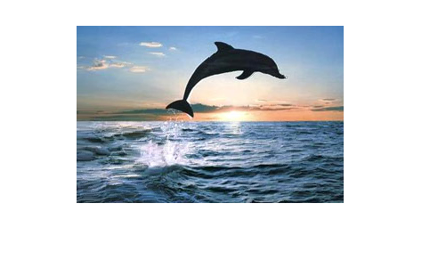
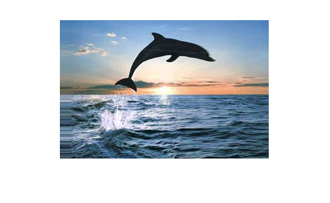
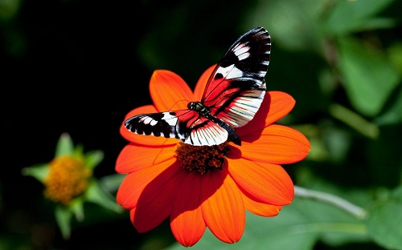

# content_aware_seam_carving
# Vertical Seam removal
Original image

Process in action

Final image

# Horizontal Seam removal
Original image

Process in action

Final image

# Seam insertion
Original image

- Energy function 1 (absolute sum of gradient in x and y)
Seam to be inserted

Process in action

Final image

- Energy function 3 (Entropy filter)
Process in action

Final image

# Object removal
Original image

Using vertical seams

Using horizontal seams

Prevent one object from distortion while removing other nearby object
-Without priortizing the object

-With high value assigned in energy function

-process in action

# Comparing optimal seam removal with sub-optimal methods
Original image

-Vertical seam then horizontal

-Horizontal seam then vertical

-Alternating vertical and horizontal

-Optimal method

